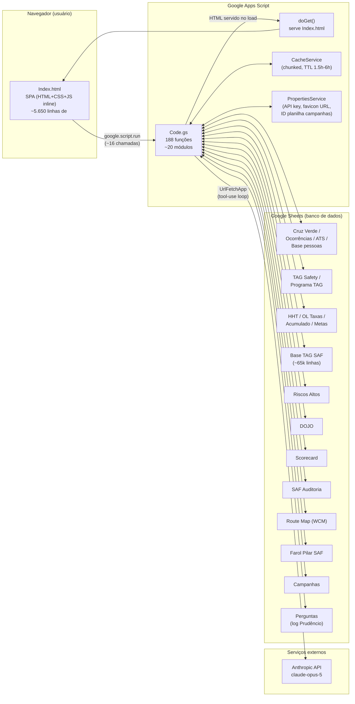

# BRIEFING — Site EHS (Environment, Health & Safety)

> Documento gerado por mapeamento automatizado do código-fonte em 2026-09-20.
> Cobre `Code.gs` (9.166 linhas / 188 funções) e `Index.html` (7.654 linhas, SPA embutida).
> Nenhum código foi alterado na geração deste documento — é apenas leitura e análise.

---

## 1. Visão geral do produto

O **Site EHS** é um painel corporativo de Segurança do Trabalho (Environment, Health & Safety)
da planta industrial, construído inteiramente em **Google Apps Script**: um backend em
`Code.gs` que lê/agrega dados de ~12 Google Sheets, e um frontend SPA (`Index.html`) servido
como web app (`doGet`), consumido via `google.script.run`. Não há banco de dados tradicional
nem framework — tudo roda dentro do ecossistema Google Workspace, com autenticação delegada ao
login Google corporativo.

Público-alvo: times de EHS/Segurança, gestores de área e liderança de planta, que acompanham
indicadores de segurança (FAI, Recordable, TRIR), ações corretivas (ATS), auditorias (SAF),
adesão a treinamentos (DOJO), avanço do programa TAG SAF (observações preventivas) e riscos
altos cadastrados. Há também um assistente de IA embutido, **"Prudêncio"**, que responde
perguntas em linguagem natural sobre esses indicadores usando a API da Anthropic (Claude),
com fallback baseado em regras quando a IA não está disponível.

Principais módulos funcionais visíveis ao usuário:
- **Home / Pilar de Segurança** — dashboard executivo (KPIs FAI/REC/DOJO/TAG, pirâmide de
  segurança, Cruz Verde resumida, tendências TRIR/FAI, rotina do pilar).
- **METRICS SAF ("Cruz Verde")** — painel analítico com 4 abas: Panorama (Pirâmide de
  Segurança + Cruz Verde + Boneco), Apontamentos (visão geral + TAG Safety), ATS (ações em
  aberto), Áreas FAI/REC (ocorrências, causa raiz, objeto causador, partes do corpo).
- **RISK ("Riscos Altos")** — registro e acompanhamento de riscos de alta severidade.
- **SMAT** — link externo (fora do app, não integrado via JS).
- **Prudêncio** — chatbot de IA flutuante, grounded nos mesmos dados exibidos nos cards.

---

## 2. Arquitetura

Não há build step, bundler, testes automatizados ou CI/CD visíveis no repositório — o
deploy é o modelo padrão do Apps Script (editor → "Implantar"). O `README.md` está
praticamente vazio.

---

## 3. Inventário de módulos do backend (`Code.gs`)

| Módulo | O que faz | Funções-chave |
|---|---|---|
| **Web app entry points** | Serve o HTML e dados de sessão do usuário | `doGet`, `obterDadosIniciais` |
| **Favicon** | Favicon dinâmico via PropertiesService | `faviconPrudencioUrl_`, `definirFaviconUrl` |
| **Cache** | Wrapper sobre `CacheService` com chunking (contorna limite de 100KB) e TTL diferenciado; aquecedor de cache agendável | `cacheGravarGrande_`, `cacheLerGrande_`, `aquecerCaches`, `criarAcionadorAquecimento` |
| **Normalização texto/data/número** | Utilitários genéricos de parsing usados por quase todos os módulos | `normalizarTexto_`, `montarDataSegura_`, `formatarDataBr_`, `parseMoedaBr_` |
| **Parsing de planilhas** | Localização tolerante de colunas/abas por nome com fallback posicional | `localizarColuna_`, `localizarAbaTolerante_`, `resolverColunaPorNomeOuPosicao_` |
| **Canonicalização de Área** | Reconcilia 3 taxonomias de área diferentes (Cruz Verde, Ocorrências, TAG SAF) em uma grafia canônica | `obterRotuloCanonicoArea_`, `reconciliarTagSafComAreas_` |
| **TAG SAF** | Base consolidada (~65k linhas) de observações preventivas; alimenta a pirâmide de segurança | `obterTotaisTagSaf_`, `getTagSafRegistros` |
| **TAG SAFETY / Programa TAG** | Respostas de formulário de matriz de risco (probabilidade×severidade) | `obterTagSafety_`, `obterResumoProgramaTag_` |
| **Cruz Verde** | Calendário "cruz de segurança" (dia a dia, cor por gravidade do evento) | `getCruzAnoCompleto`, `getContextoCruzSeguranca` |
| **Prudêncio (IA)** | Chatbot com loop agentic via Claude (tool-use), fallback baseado em regras, log de perguntas | `prudencioPerguntar`, `prudencioPerguntarInterno_`, `prudencioResponderSemIa_`, `prudencioFerramentas_` |
| **RISK — Riscos Altos** | Registro de riscos de alta severidade | `getRiscosAltos` |
| **Home / HHT / Metas / Scorecard / DOJO / OL Taxas** | Agregador do dashboard executivo | `getBootstrapDados`, `getResumoHome`, `obterDadosHHT_`, `obterResumoDojo_` |
| **Campanhas** | Banner de campanha de conscientização do mês, no "Meu Feed" | `obterCampanhaAtual`, `configurarCampanhas` |
| **Boneco / Partes do Corpo** | Diagrama corporal de lesões, Pareto FAI×Recordable | `getPartesDoCorpoAnoCompleto`, `getParetoFaiRec` |
| **ATS — Ações em Aberto** | Status de ações corretivas, Pareto por responsável/área | `getAtsAbertos`, `obterMapaPessoasAts_` |
| **Ocorrências — Painel Analítico** | Status de ocorrências, drill-down por área | `getOcorrenciasPainel` |
| **Causa Raiz** | Desmembra e agrupa causas raízes das ocorrências | `getCausaRaiz` |
| **Objeto Causador** | Classificação do objeto causador do acidente | `getObjetoCausadorData` |
| **Comportamento/Condição** | Classifica ocorrências como comportamento inseguro ou condição insegura | `getComportamentoCondicao` |
| **SAF Auditoria** | Rastreamento de ações de auditoria de checklist (maior função do arquivo, 283 linhas) | `getSafAuditoria` |
| **Route Map (WCM)** | Avanço de steps do World Class Manufacturing por área | `getRouteMap`, `obterRouteMap_` |
| **Farol SAF** | Fonte de verdade para indicadores de Expansão/Extensão/Aderência | `getFarolSaf` |

**36 das 188 funções (~19%) são `debug*`** — diagnósticos manuais rodados no editor do Apps
Script, não parte do fluxo request/response. É uma convenção deliberada do projeto (bem
comentada), mas quase dobra a superfície do arquivo.

---

## 4. Modelo de dados (Google Sheets como banco de dados)

12 IDs de spreadsheet são referenciados no código, mas **3 pares são o mesmo workbook físico**
sob nomes de constante diferentes — um total de **9-10 planilhas únicas**:

| Planilha (papel) | Abas | Colunas-chave identificadas | Funções leitoras/escritoras |
|---|---|---|---|
| **Cruz Verde / Ocorrências** (mesmo workbook que Ocorrências, ATS e Base pessoas) | `Cruz verde`, `Ocorrências (FAI / REC)`, `ATS`, `Base pessoas` | Cruz Verde: Status Gensuite, N° Gensuite, Tipo do evento, Data, Turno, Área Macro/micro, Máquina, Descrição. Ocorrências: 145 colunas (export OSHA/Gensuite) — `Inj. DAFW?`, `U.S. OSHA Recordable?`, `Locally Reportable?` (critério BR, vigente desde 2026-08-17), `Extent`, `Area`, `Body Part`, `Cause Object`, `Case Date`. ATS: `Responsible Person`, `Area`, `Action Status`, `Days Open/To Close` | `obterCruzVerdeLinhas_`, `getOcorrenciasPainel`, `getAtsAbertos`, `getCausaRaiz`, `getObjetoCausadorData`, `getComportamentoCondicao`, `getParetoFaiRec` (somente leitura) |
| **Base TAG SAF** | `BASE TAG - SAF` (~65k linhas) | Colunas resolvidas dinamicamente (RELATO, data, área, tipo) | `obterTotaisTagSaf_`, `getTagSafRegistros` (somente leitura) |
| **TAG Safety / Programa TAG** (mesmo workbook) | `TAG SAFETY` (~9.6k linhas), `Respostas ao formulário 5` | Matriz probabilidade×severidade, coluna de área por termo "identificou" | `obterTagSafety_`, `obterResumoProgramaTag_` (somente leitura) |
| **HHT / OL Taxas** (mesmo workbook) | `HHT Total1`, `{ano} Acumulado`, `Metas {ano}`, `YTD real + projeção` | Homens-hora trabalhadas; `YTD real + projeção` usa **células fixas** `AW162`/`F162` (único ponto do arquivo sem lookup por nome) | `obterDadosHHT_`, `obterAcumuladoPlanta_`, `obterMetasPlanta_`, `obterOlTaxas_` |
| **Riscos Altos EHS** | `Riscos Altos` | Ranking Risco, Área, Macro Tema, Risco, Plano de Ação, Status, Meta/Realizado Acumulado | `getRiscosAltos` (única função de destaque **sem** try/catch e **sem** cache) |
| **DOJO** | `Trat` | Adesão a treinamentos (%) | `obterResumoDojo_` |
| **Scorecard Manufatura LAR** | `Semanal/Mensal RC {ano}` | KPIs de scorecard semanal/mensal | `obterDadosScorecard_` |
| **SAF Auditoria** | `SAF` | 16 colunas (A–P); coluna E ("área") sem cabeçalho, sempre posicional por design | `getSafAuditoria` |
| **Route Map (WCM)** | `Route Map_2026` | Layout complexo: header de ano mesclado + prefixos de mês, blocos por área | `obterRouteMap_`, `getRouteMap` |
| **Farol Pilar SAF** | `Farol Pilar SAF New` | Espera exatamente 202 áreas na coluna D (linhas 3–204) | `getFarolSaf` |
| **Campanhas** | `Campanhas` | Banner do mês; ID **não hardcoded**, criado em runtime e salvo em `PropertiesService` | `obterCampanhaAtual`, `configurarCampanhas` (leitura + escrita) |
| **Perguntas** | `perguntas` | Log append-only: Data/Hora, Usuário, Pergunta, Situação, Intenção, Modo, Resposta | `registrarPerguntaPrudencio_` (somente escrita) |

**Config fora de planilha** (`PropertiesService.getScriptProperties()`): `ANTHROPIC_API_KEY`
(chave da API Claude — corretamente fora do código-fonte), `PRUDENCIO_FAVICON_URL`,
`campanhasPlanilhaId`.

---

## 5. Frontend — funcionalidades e conexão com o backend

`Index.html` é um arquivo único: `<head>`/config (1–55), `<style>` inline (54–371), markup
(375–1998), e um bloco `<script>` gigante (1999–7651, **74% do arquivo**). Não há framework —
funções globais procedurais, convenção de `_` final para "privadas", DOM manipulado via
`innerHTML`/`createElement`, gráficos 100% em SVG desenhado à mão (sem lib de charts).
Única dependência CDN: **Tailwind Play CDN** (não pinado, não recomendado para produção) e
Google Fonts.

Telas principais: loader cinemático → sidebar de navegação (Home / METRICS SAF / SMAT / RISK)
→ Home (dashboard executivo) → painel METRICS SAF (4 abas: Panorama, Apontamentos, ATS,
Áreas FAI/REC) → painel RISK. O widget do Prudêncio fica sempre acessível (FAB flutuante).

**16 chamadas `google.script.run`** identificadas, todas com `.withSuccessHandler` e
`.withFailureHandler` — porém **3 delas só fazem `console.error`**, sem feedback visual ao
usuário (`getFarolSaf`, `getPartesDoCorpoMesAtual`, `getPartesDoCorpoAnoCompleto`), deixando
o card correspondente "travado" em estado de carregamento sem indicação de erro.

O arquivo também embute um **mock completo de `google.script.run`** (~1.190 linhas,
2000–3189) usado apenas em ambiente de desenvolvimento local (ativado quando `google` não
está definido) — código morto em produção, mas que aumenta o peso do arquivo servido.

---

## 6. Dívida técnica e riscos identificados

### Estrutura / monólito
- Arquivo único de 9.166 linhas / 188 funções no backend, sem separação em módulos de
  arquivo; frontend com bloco `<script>` de ~5.650 linhas misturando ~150 funções top-level
  sem namespacing real.
- Maior função do backend: `getSafAuditoria` (283 linhas); maior "dicionário": lógica de
  intenção do Prudêncio sem IA (219 linhas).
- Sem testes automatizados, sem CI/CD, sem linter configurado visível.
- Mock de dev (~1.190 linhas) embutido no arquivo de produção `Index.html`.

### Dados / planilhas
- 3 pares de constantes de spreadsheet ID apontam para o **mesmo workbook físico**
  (Cruz Verde≡Ocorrências, TAG Safety≡Programa TAG, HHT≡OL Taxas) — armadilha de nomenclatura
  para quem não conhece o código.
- Aba `'BASE TAG - SAF'` é string literal duplicada em 2 lugares (não tem constante `*_ABA_`
  como as demais).
- `OL Taxas` usa **células fixas** (`AW162`, `F162`) — único ponto do sistema sem lookup por
  nome de coluna; inserção de linha na planilha-fonte quebra silenciosamente.
- `obterDadosHHT_` cai para colunas fixas A/D/F se a busca por nome falhar — degradação
  silenciosa.
- `AREA_RESPONSAVEL_` hardcoda **nomes reais de pessoas** como donos de área diretamente no
  código-fonte — deveria estar em planilha/config, tanto por manutenibilidade quanto por
  dado pessoal em controle de versão.
- Dependência de nomes de coluna por string é o padrão dominante e é bem mitigada com
  fallback posicional e comentários citando incidentes reais (ex.: bug de índice em
  2026-08-26) — ponto positivo, mas ainda frágil nos casos acima.

### Robustez / erros
- `getRiscosAltos` é a única função de entrada relevante **sem try/catch e sem cache**,
  inconsistente com o padrão do resto do código.
- 3 chamadas do frontend (`getFarolSaf`, `getPartesDoCorpoMesAtual`,
  `getPartesDoCorpoAnoCompleto`) falham silenciosamente no console, sem UI de erro.
- Validação de input no frontend é mínima (ex.: `prudencioEnviar` só verifica string não
  vazia; filtros de select confiam no DOM sem validação explícita antes do RPC).

### Duplicação
- Parsing de data reimplementado 3 vezes com lógicas diferentes (`parseDataOcorrencia_`,
  `safParseData_`, `montarDataSegura_`/`formatarDataBr_`).
- Resolução de cabeçalho de coluna reimplementada por módulo (Cruz Verde, Ocorrências, ATS,
  Painel, SAF Auditoria) em vez de usar o resolvedor genérico já existente
  (`resolverColunaPorNomeOuPosicao_`, usado só em 2 dos ~5 módulos).
- Parsing de número/percentual BR duplicado (`olTaxasNumero_` vs. `farolSafParsePercentual_`).
- `desenharCausaRaiz_` é cópia intencional (comentada no código) de `desenharBarrasOcor_`.
- Favicon em base64 duplicado literalmente em `Index.html` e `Code.gs`, sincronização manual.

### Dependências externas
- Tailwind via CDN "Play" (não recomendado para produção, sem versão pinada, sem SRI).
- Google Fonts sem SRI (limitação do próprio serviço, mas ainda é dependência não pinada).

### Funções mortas
- `routeMapUltimoMes_` confirmada sem nenhuma referência no projeto — candidata a remoção.
- `criarAcionadorAquecimento`, `limparFaviconUrl`, `linkPlanilhaCampanhas` — utilitários
  manuais sem chamador, plausivelmente intencionais (setup/manutenção pontual).
- 16 funções `debug*` sem chamador — esperado dado o padrão de diagnóstico manual do projeto.

### Positivo (vale registrar)
- Chave da API Anthropic corretamente fora do código-fonte (`PropertiesService`).
- Única chamada de rede externa (`prudencioChamarApi_`) bem protegida
  (`muteHttpExceptions`, checagem de status, parse com try/catch).
- Comentários extensos e bem escritos documentando decisões e incidentes passados —
  compensa parcialmente a falta de estrutura/testes.
- Sistema de cache com chunking bem pensado para contornar limite de 100KB do
  `CacheService`.

---

## 7. Sugestões de próximos passos (não implementado, apenas recomendação)

1. **README real**: documentar como implantar, IDs de planilha necessários, variáveis de
   `PropertiesService` esperadas e como rodar o mock de desenvolvimento.
2. **Extrair um mapa central de spreadsheet IDs/abas** (um único objeto de configuração)
   para eliminar a armadilha dos workbooks duplicados sob nomes diferentes.
3. **Padronizar error handling**: aplicar o padrão try/catch + cache já usado na maioria dos
   `get*` também em `getRiscosAltos`; dar feedback visual de erro nos 3 pontos do frontend
   que hoje só logam no console.
4. **Consolidar utilitários duplicados**: um único parser de data BR, um único resolvedor de
   coluna por nome/posição, um único parser de número/percentual — os módulos já mostram
   consciência do padrão (`resolverColunaPorNomeOuPosicao_` existe), falta generalizar.
5. **Mover dados pessoais para fora do código**: `AREA_RESPONSAVEL_` para uma aba dedicada.
6. **Remover ou isolar o mock de `google.script.run`** do `Index.html` de produção (ex.:
   arquivo de dev separado, carregado só localmente) para reduzir o peso do SPA servido.
7. **Avaliar substituir o Tailwind CDN "Play"** por uma build compilada/pinada, dado o aviso
   oficial do próprio Tailwind contra uso em produção.
8. **Introduzir testes mínimos** para as funções puras de parsing/normalização (não dependem
   de `SpreadsheetApp`, são as mais fáceis de testar isoladamente) — bom primeiro passo antes
   de qualquer refatoração maior.
9. **Avaliar quebrar `Code.gs` em múltiplos arquivos `.gs`** por módulo (Apps Script suporta
   múltiplos arquivos no mesmo projeto) — reduz o custo cognitivo de navegar 9k linhas em um
   arquivo só, sem exigir build step.
10. **Confirmar e limpar funções mortas** (`routeMapUltimoMes_` e utilitários sem chamador)
    após validar com o time se algum é usado fora deste repositório (ex.: acionado por
    trigger configurado manualmente no projeto Apps Script).
