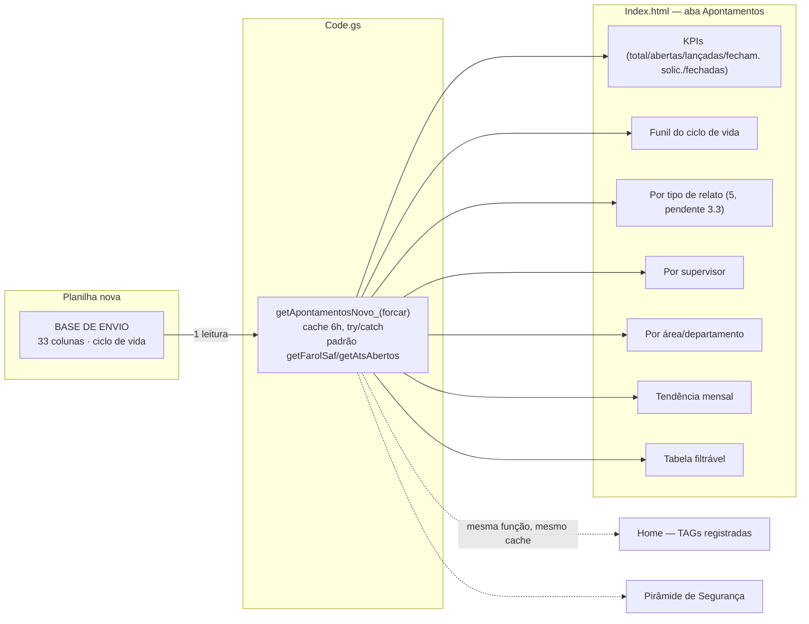

# Reconstrução da aba Apontamentos — Projeto A (leitura)

> Escopo: só a reconstrução da página/dados (leitura). O Projeto B (Prudêncio
> lançando TAG por conversa, com escrita na planilha) é um sub-projeto
> separado, com seu próprio ciclo de brainstorm → spec → plano, depois deste.

## 1. Por que reconstruir

A aba Apontamentos de hoje (dentro do painel METRICS SAF) só mostra uma
tabela mensal (Inc./Quase/1º Soc./Com·Sem afastamento) e um heatmap
área×mês de condições inseguras, lendo a planilha antiga "Base TAG SAF"
(~65 mil linhas, só contagem bruta, sem ciclo de vida). Três coisas faltam,
confirmadas com o usuário:

1. **Ciclo de vida da TAG** — não dá pra ver quantas TAGs estão abertas,
   lançadas no Gensuite, com fechamento solicitado ou já fechadas.
2. **Abertura por responsável/supervisor** — não dá pra ver quem concentra
   TAGs em aberto.
3. **Os tipos de relato separados** — hoje viram um número só; a base real
   tem 5 tipos distintos (ver seção 3), incluindo "Ato Seguro", que hoje
   não aparece em lugar nenhum.

## 2. Decisão de escopo (confirmada com o usuário)

A nova fonte de dados (planilha `1or9ddLm44pMYkh5E-rvfHBY38ikMku2Ixzzm2Km12fY`,
aba **BASE DE ENVIO**) substitui a antiga "Base TAG SAF" em **3 lugares**,
não só na aba Apontamentos:

- Aba Apontamentos (reconstrução completa, este documento).
- KPI "TAGS REGISTRADAS" da Home.
- Pirâmide de Segurança.

As funções antigas (`obterTagSafety_`, `obterTotaisTagSaf_`,
`TAG_SAF_SPREADSHEET_ID`) saem de uso nessas 3 telas quando a migração for
validada. Não removidas neste documento — a remoção efetiva do código morto
fica pro plano de implementação decidir (manter como fallback até
confirmar em produção, ou remover direto).

## 3. Modelo de dados

### 3.1 Planilha nova — 4 abas

ID da planilha: `1or9ddLm44pMYkh5E-rvfHBY38ikMku2Ixzzm2Km12fY` (é o link
ORIGINAL que o usuário passou — não o ID da cópia usada só para eu
inspecionar a estrutura).

#### Aba "BASE DE ENVIO" — fonte única do Projeto A

Cabeçalho confirmado pelo usuário (colado direto da planilha viva, 33
colunas, A–AG):

| Col | Cabeçalho | Papel no design |
|---|---|---|
| A | DATA | Data do evento — eixo da tendência mensal |
| B | RE | RE do relator |
| C | TURNO | Turno do relato |
| D | ÁREA DO RELATOR | Área de quem relatou |
| E | TAG | Indicador se o relato gerou TAG |
| F | Nº TAG | Número da TAG |
| G | PILAR TAG | Pilar de gestão |
| H | CLASSIFICAÇÃO | **Papel ainda não confirmado** — ver 3.3 |
| I | ÁREA DO DESVIO | Área onde o problema ocorreu — pareto por área |
| J | LOCAL DETALHADO | Detalhe do local |
| K | DESCRIÇÃO DO EVENTO | Texto livre |
| L | AÇÃO IMEDIATA | Texto livre |
| M | PROBABILIDADE | Matriz de risco |
| N | GRAVIDADE | Matriz de risco |
| O | RELACAO ATO INSEGURO | Natureza do comportamento (quando aplicável) |
| P | RE ENVOLVIDO | RE de quem cometeu o ato (quando aplicável) |
| Q | NOME ENVOLVIDO | Nome de quem cometeu o ato |
| R | PRIORIDADE TAG | Prioridade — possível card/filtro extra |
| S | HTML CLASSIFICAÇÃO | Código de integração Gensuite (não exibido) |
| T | ÁREA GENSUITE | Área padronizada Gensuite — pareto |
| U | DEPARTAMENTO GENSUITE | Departamento — pareto |
| V | ATIVIDADE PRINCIPAL | Atividade principal |
| W | SUPERVISOR GENSUITE | **Pareto "por supervisor"** |
| X | EMAIL SUPERVISOR | Não exibido na v1 |
| Y | LANÇADO GENSUITE | **Estágio 2 do funil** |
| Z | DATA LANÇAMENTO GENSUITE | Data do estágio 2 |
| AA | Nº GENSUITE | ID gerado pelo Gensuite |
| AB | SOLICITADO FECHAMENTO | **Estágio 3 do funil** |
| AC | DATA SOLICITAÇÃO FECHAMENTO | Data do estágio 3 |
| AD | SOLICITANTE FECHAMENTO | Quem pediu o fechamento |
| AE | FECHADO GENSUITE | **Estágio 4 do funil** |
| AF | DATA FECHAMENTO GENSUITE | Data do estágio 4 |
| AG | ID_UNICO | Chave primária — dedup, se necessário |

BASE DE ENVIO já é **consolidada por um processo existente** (script ou
trabalho manual, fora do Code.gs) — o Projeto A só **lê**, não recalcula
nem gera essa base.

#### Aba "Respostas ao formulário" — NÃO usada pelo Projeto A

Investigada (6.906 linhas reais, lidas via export) só para entender a
origem dos "tipos de relato" e confirmar a lista real. **5 tipos**, não 3
como o dicionário original sugeria:

| Tipo (valor real na coluna E) | Linhas | Bloco de colunas que usa |
|---|---|---|
| ATOS INSEGUROS - Segurança e Meio Ambiente | 2.835 | M, P–T (bloco **Ato Inseguro**, apesar do nome) |
| SEGURANÇA - VER E AGIR | 1.929 | AA–AE (bloco condição insegura #2) |
| TAG - SAF - Safety | 962 | F–L (nº TAG + bloco condição insegura #1) |
| ATOS SEGUROS | 1.105 | AF–AK (bloco ato seguro) |
| TAG - ENV - Environment | 75 | U–Z (bloco "pilar/desvio") |

Esta aba fica reservada para o Projeto B (Prudêncio escrevendo TAGs) — o
Projeto A não precisa dela porque BASE DE ENVIO já é o dado tratado.

#### Aba "Listas" — NÃO usada pelo Projeto A

Confirmada por amostragem: `Classificação SAF` (3 valores: Risco Muito
alto/alto, Risco Médio/Baixo, Risco Muito baixo), `Classificação
formulario` (~11 valores), mapeamento ÁREA FORMS→ÁREA GENSUITE→DEPARTAMENTO
(dezenas de linhas, **com lacunas** — algumas células de ÁREA GENSUITE em
branco mesmo com ÁREA FORMS preenchida). Relevante pro Projeto B e para a
Abordagem 2 (ver 3.4), não pro Projeto A v1.

#### Aba "Turno x Responsáveis" — reservada pra Abordagem 2 (fase 2)

Cabeçalho confirmado: `AREA | 1ºT | 2ºT | 3ºT | 4ºT` — matriz área×turno →
nome do responsável. Não usada na v1 do Projeto A (ver 3.4).

### 3.2 Funções que saem de uso (não removidas nesta leva)

`obterTagSafety_`, `obterTotaisTagSaf_`, `TAG_SAF_SPREADSHEET_ID`,
`TAG_SAFETY_SPREADSHEET_ID_`/`PROGRAMA_TAG_SPREADSHEET_ID_` (essa última só
se nada mais na aba Apontamentos continuar precisando da matriz de risco
"TAG SAFETY" separada — **a verificar durante o plano**: a matriz de risco
por probabilidade×severidade pode ou não ter equivalente dentro de BASE DE
ENVIO via `PROBABILIDADE`/`GRAVIDADE`, colunas M/N).

### 3.3 Item em aberto — coluna "tipo de relato" na BASE DE ENVIO

Não há coluna óbvia "TIPO"/"RAMIFICAÇÃO" na BASE DE ENVIO batendo 1:1 com
os 5 tipos achados em "Respostas ao formulário". Candidatas a investigar
com dado real antes de implementar o card "por tipo":

- `CLASSIFICAÇÃO` (H) — pode ser risco (Muito Alto/Médio/Baixo) e não tipo.
- `RELACAO ATO INSEGURO` (O) — populada só quando é ato inseguro?
- `RE ENVOLVIDO`/`NOME ENVOLVIDO` (P/Q) — populados só quando há um
  terceiro envolvido (ato inseguro/seguro), vazios nos outros tipos —
  mesma técnica de "colunas preenchidas por tipo" que resolveu a
  ambiguidade da aba Respostas ao formulário nesta sessão.
- Inferência por presença/ausência de campos, como acima, se não houver
  coluna explícita.

**Plano de resolução**: antes de escrever a agregação "por tipo", criar
`debugApontamentosNovo_()` (mesmo padrão de `debugStatusAts`/
`debugFontesHome`) que lê uma amostra real de BASE DE ENVIO e reporta a
distribuição de valores de cada coluna candidata — só then a lógica de
classificação por tipo é escrita, com base no que os dados realmente
mostram, não em suposição.

### 3.4 Abordagem 2 (fase 2, não nesta leva)

Quando `SUPERVISOR GENSUITE` vier em branco (deve acontecer, dado que o
mapeamento em "Listas" tem lacunas), cruzar `ÁREA DO DESVIO`/`ÁREA
GENSUITE` + `TURNO` com a aba "Turno x Responsáveis" como reforço. Fica
para depois de medir o tamanho real da lacuna com a v1 rodando.

## 4. Arquitetura

Uma função, uma leitura de planilha, cache único (padrão já estabelecido
no projeto: `cacheLerGrande_`/`cacheGravarGrande_`, TTL 6h, `forcar` para
recarregar). Home e Pirâmide passam a chamar essa mesma função em vez de
`obterTotaisTagSaf_`/`obterTagSafety_`.

## 5. Seções da página (frontend)

1. **KPIs no topo** — Total de TAGs no período, Abertas, Lançadas no
   Gensuite (aguardando fechamento), Fechamento solicitado, Fechadas.
   Mesmo estilo visual das tiles do RISK.
2. **Funil do ciclo de vida** — 4 estágios derivados de
   `LANÇADO GENSUITE`/`SOLICITADO FECHAMENTO`/`FECHADO GENSUITE`. Sem SLA
   inventado: mostra dias em aberto por TAG (a partir de `DATA`), quem lê
   decide o que é demorado — mesmo princípio do ATS/RISK.
3. **Por tipo de relato** — pareto/donut das 5 categorias, com paleta
   **categórica nova** (não a de gravidade vermelho/laranja/amarelo — os 5
   tipos não são graus de severidade; reusar essa paleta insinuaria uma
   ordem que não existe). Bloqueado por 3.3.
4. **Por supervisor** — pareto usando `SUPERVISOR GENSUITE`, balde cinza
   "sem supervisor" pro que vier em branco, mesmo padrão visual do
   ATS/Ocorrências (`segmentoBarra3D_`, já existente).
5. **Por área/departamento** — pareto usando `ÁREA GENSUITE`/
   `DEPARTAMENTO GENSUITE`.
6. **Tendência mensal** — TAGs abertas por mês (`DATA`), mesmo estilo de
   barra empilhada 3D de "Ocorrências por Ano" (`desenharFaiRec_`/
   `FAIREC_SERIES_` como referência de padrão, não reuso direto — série
   diferente).
7. **Tabela de detalhamento** — filtrável (tipo, supervisor, área,
   status), rolável com cabeçalho fixo + zebra (`tabela-zebra`, já
   existente), mesmo padrão da tabela do RISK.

## 6. Tratamento de erro

Segue o padrão já dominante no projeto: `getApontamentosNovo_` nunca
lança — devolve `{ erro }` se a planilha/aba/coluna falhar. Colunas
resolvidas por NOME (não posição fixa), com erro explícito se alguma das
colunas usadas pelas seções acima não for encontrada — mesmo padrão do
`getRiscosAltos` já corrigido nesta sessão (`RISCOS_COLUNAS_OBRIGATORIAS_`).

## 7. Teste

Sem ambiente de teste automatizado no projeto (ver BRIEFING.md). Validação
por: (a) `debugApontamentosNovo_()` rodado no editor contra a planilha
viva antes de confiar nos números: (b) mock local do
`getApontamentosNovo_` no `google.script.run` de desenvolvimento, seguindo
o padrão já usado por `getAtsAbertos`/`getOcorrenciasPainel`, pra visual QA
no navegador via o mock já embutido no `Index.html`; (c) teste manual no
navegador (Chrome DevTools) cobrindo os 7 cards antes de considerar
pronto.

## 8. Fora de escopo deste documento

- **Projeto B** (Prudêncio lançando TAG por conversa, escrevendo em
  "Respostas ao formulário") — sub-projeto próprio, brainstorm dedicado
  depois que o Projeto A estiver implementado.
- Abordagem 2 (cruzamento com "Turno x Responsáveis") — fase 2, condicional
  ao tamanho da lacuna de `SUPERVISOR GENSUITE` observada em produção.
- Remoção definitiva das funções/planilha antigas de TAG SAF — decisão do
  plano de implementação, não deste documento de design.
